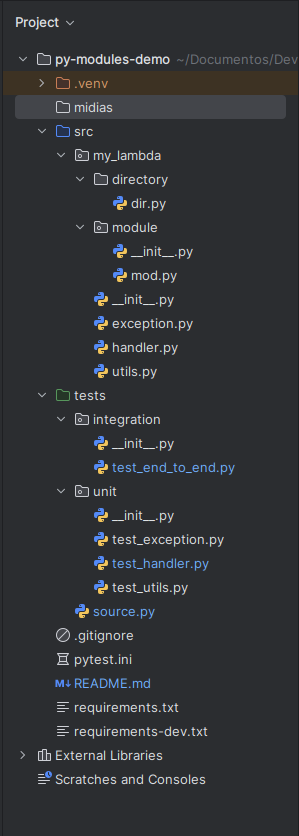
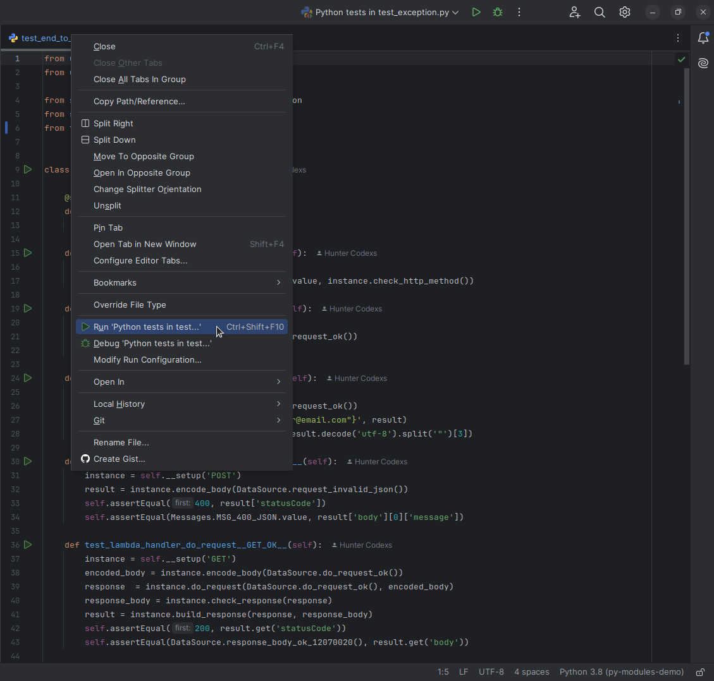
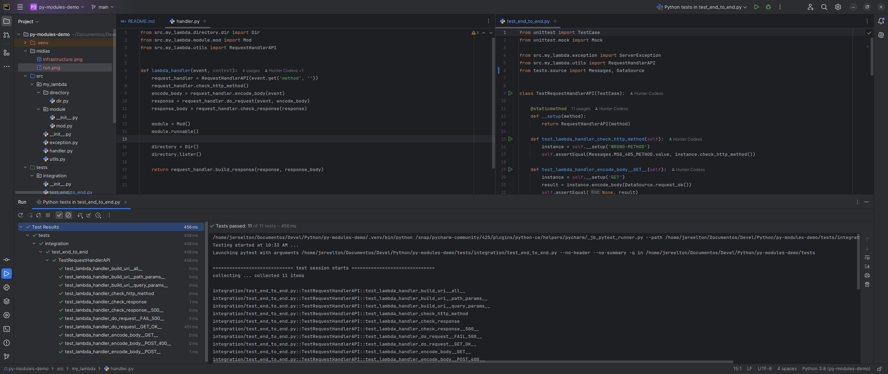

# PYTHON MODULES DEMO
This repository has the simple and only goal, to demonstrate a python project module infrastructure.

# Definitions

- Overview

Below we can see the complete structure of folders and packages (modules) that compose this repository.

- Concepts to consider

Ensure that the paths are correctly set in each of files related to this kind of projects pointing the exact 
location for all modules, for example:

<pre>
from src.my_lambda.directory.dir import Dir
from src.my_lambda.module.mod import Mod
from src.my_lambda.utils import RequestHandlerAPI

def lambda_handler(event, context):
    request_handler = RequestHandlerAPI(event.get('method', ''))
    check_http_method = request_handler.check_http_method()

    if check_http_method is not None:
        return check_http_method

    encode_body = request_handler.encode_body(event)
    response = request_handler.do_request(event, encode_body)
    response_body = request_handler.check_response(response)

    module = Mod()
    module.runnable()

    directory = Dir()
    directory.lister()

    return request_handler.build_response(response, response_body)
</pre>

In the above code we can see the following lines:

<pre>
from src.my_lambda.directory.dir import Dir
from src.my_lambda.module.mod import Mod
from src.my_lambda.utils import RequestHandlerAPI
</pre>

It means that each module or package are placed in the path informed path.sub-path.module

Another attention point is the file named pytest.ini that contains the content below

<pre>
[pytest]
testpaths = tests
addopts = -v --disable-warnings
</pre>

Using the pytest configuration we can define the exact location of sources tests that in this case is the own tests 
package folder

- Testing

It is possible to execute the tests inside this repository using the IDEA IntelliJ clicking on tab of test file and 
choosing the "Run python test...", for example:

The result should be something like below

